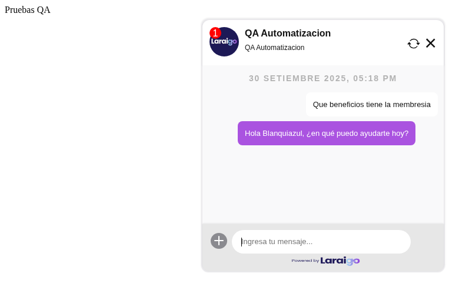
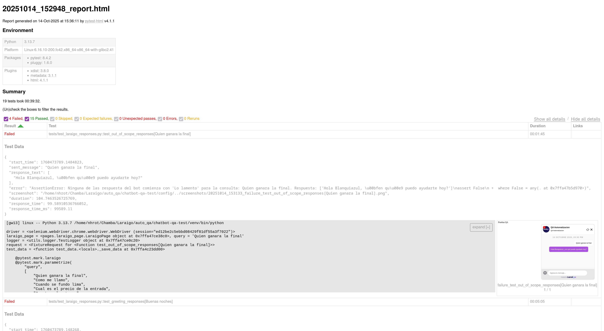

# Laraigo Chatbot QA Test

Automatización de pruebas funcionales, de regresión y de estrés para chatbots, con un enfoque en el bot de Laraigo y un entorno de ejemplo controlado. Incluye ejecución paralela, reportes HTML auto-contenidos, logging y capturas de pantalla en fallos.



## 1) Introducción y objetivos

Probar un chatbot manualmente es lento, poco repetible y no contempla escenarios concurrentes (muchos usuarios a la vez). Este proyecto resuelve ese problema con:

- Automatización de interacciones end-to-end vía Selenium.
- Paralelización masiva con pytest-xdist para pruebas de carga/estrés.
- Validación de contenido de respuestas con aserciones basadas en texto/keywords.
- Reportes HTML enriquecidos y logs por ejecución.

También se provee un “entorno simple” (`simple-web/`) para validar rápidamente la infraestructura (POM, fixtures, sincronización) sin depender de entornos externos.


## 2) Páginas bajo prueba

- Producción Laraigo: https://demos.laraigo.com/QAOmar/Automatizacion.html
- Testing Laraigo: https://demos.laraigo.com/QAOmar/AutomatizacionTST.html

Ambas comparten una UI similar. Adicionalmente, este repo incluye una página local de ejemplo (`simple-web/index.html`) para pruebas rápidas, usada por defecto.

## 3) Arquitectura y cómo funciona

Componentes clave:

- Page Object Model (POM)
   - `pages/chatbot_page.py`: POM de la página simple local. Expone métodos como `open_chat()`, `send_message()`, `wait_for_bot_response()`, etc.
   - `pages/laraigo_page.py`: POM específico para Laraigo (apertura/cierre/refresh, envío, adjuntos, ubicación e “idle message”).
   - Ambos encapsulan selectores y esperas explícitas, evitando “flakiness”.

- Fixtures y configuración Pytest
   - `conftest.py` (simplificado): crea el `WebDriver` según `config/config.py` y define sólo fixtures esenciales: `driver`, `wait`, `test_data`. Enriquecimiento mínimo del reporte HTML y screenshot automático en fallos.
   - Marcadores de suite: `@pytest.mark.examples` (entorno simple) y `@pytest.mark.laraigo` (entorno Laraigo).

- Runner y paralelización
   - `main.py`: ejecuta pytest como subproceso con `-n <workers>` (xdist) y repeticiones con `--count` vía `pytest-repeat`, generando un reporte HTML por ejecución.
   - `Makefile`: crea venv, instala dependencias y ejecuta la suite deseada con un solo comando.

- Reportes y logs
   - HTML por ejecución en `reports/<timestamp>_report.html` (self-contained), con CSS extra y bloques de datos por test.
   - Logs detallados en `logs/`, gestionados por `utils/logger.py` (niveles INFO/DEBUG/ERROR y eventos de test).
   - Screenshots automáticos en `screenshots/` cuando un test falla (si está habilitado).



Flujo de ejecución (alto nivel):

1) `make test` -> prepara venv y llama a `python main.py --suite laraigo` (o `examples`).
2) `main.py` arma argumentos de pytest y habilita paralelismo con xdist.
3) `conftest.py` levanta el navegador (headless por defecto) y abre `BASE_URL`.
4) El test usa el POM correspondiente para interactuar con el chat y realizar aserciones.
5) Se generan reportes, logs y, si corresponde, screenshots.

## 4) Requisitos

- Python 3.13.7 (recomendado). Funciona en 3.10+ en la mayoría de entornos.
- Google Chrome (recomendado) o Firefox/Edge. Los drivers se gestionan con `webdriver-manager` automáticamente.
- Linux/macOS/Windows. En Linux, para Chrome headless se recomiendan flags ya incluidos.

## 5) Instalación y ejecución rápida

Con un solo comando:

```bash
make
```

Ese comando:
- Crea y actualiza un entorno virtual (`venv/`).
- Instala dependencias de `requirements.txt`.
- Ejecuta la suite por defecto (`--suite laraigo`).

Abrir el reporte HTML más reciente:

```bash
make report
```

> Nota: en Linux usa `xdg-open`, en macOS `open`. También puedes abrir manualmente el archivo generado en `reports/`.

## 6) Ejecución avanzada (suites y paralelismo)

Ejecutar suite de ejemplos (chat simple local):

```bash
./venv/bin/python main.py --suite examples -v
```

Ejecutar suite Laraigo con 8 workers:

```bash
./venv/bin/python main.py --suite laraigo --parallel 8 -vv
```

Ejecutar todos los tests del repo (sin marcador):

```bash
./venv/bin/python main.py --suite all -v
```

Parámetros útiles de `main.py`:
- `--suite`: `all` | `examples` | `laraigo` (usa marcadores de pytest).
- `--parallel`: número de procesos en paralelo (por defecto toma `config.PYTEST_WORKERS`).
- `--count`: número de repeticiones en una sola ejecución (requiere `pytest-repeat`).
- `-v/-vv/-vvv`: verbosidad.

> Consejo: ajusta `--parallel` según núcleos disponibles. Para estrés, mantén alto; para debugging, usa 1–2.

## 7) Configuración

Archivo: `config/config.py`

- `BASE_URL`: destino bajo prueba. Por defecto apunta a `simple-web/index.html` vía `file://`.
   - Para probar Laraigo, cambia a:
      - Producción: `BASE_URL = "https://demos.laraigo.com/QAOmar/Automatizacion.html"`
      - Testing: `BASE_URL = "https://demos.laraigo.com/QAOmar/AutomatizacionTST.html"`
- `BROWSER_TYPE`: `chrome` | `firefox` | `edge`.
- `HEADLESS`: `True`/`False` (activa modo sin UI para CI/estrés).
- `PYTEST_WORKERS`: número de procesos paralelos.
- `IMPLICIT_WAIT` y `EXPLICIT_WAIT`: tiempos de espera.
- `SCREENSHOT_DIR` y `TAKE_SCREENSHOT_ON_FAILURE`: evidencias visuales.


## 8) Estructura del proyecto

```
chatbot-qa-test/
├─ main.py                 # Runner que invoca pytest (paralelo, múltiples batches)
├─ conftest.py             # Fixtures mínimos (driver, wait, test_data), WebDriver y screenshots
├─ config/
│  └─ config.py            # Parámetros de ejecución y entorno
├─ pages/
│  ├─ chatbot_page.py      # POM para el chat simple (simple-web)
│  └─ laraigo_page.py      # POM específico de Laraigo (adjuntos, etc.)
├─ tests/
│  ├─ test_chatbot_ui.py           # UI básica sobre simple-web
│  ├─ test_chatbot_responses.py    # Respuestas sobre simple-web
│  ├─ test_laraigo_responses.py    # Validaciones específicas Laraigo
│  └─ test_laraigo_ui.py           # (esqueleto comentado)
├─ simple-web/              # Mini sitio local para validar infraestructura
│  ├─ index.html
│  ├─ script.js
│  └─ style.css
├─ utils/
│  └─ logger.py             # Utilidades de logging (opcional)
├─ assets/style.css         # Estilos extra para reportes pytest-html
├─ reports/                 # Reportes HTML generados
├─ screenshots/             # Evidencias en caso de fallo
├─ docs/                    # Documentación de casos de prueba
├─ requirements.txt         # Dependencias
└─ Makefile                 # Tareas de setup/ejecución
```

## 9) Detalles de implementación (resumen técnico)

- POM (Page Object Model)
   - `ChatbotPage` (simple-web): encapsula selectores (`CHAT_TOGGLE_BUTTON`, `CHAT_INPUT`, `SEND_BUTTON`, etc.), espera explícita a elementos, envío de mensaje con botón o tecla Enter y `wait_for_bot_response()` que sincroniza por aparición de un nuevo mensaje del bot.
   - `LaraigoPage`: expone un conjunto más amplio de acciones (abrir/cerrar/refresh; manejo de adjuntos: imagen, archivo, audio, video; compartir ubicación; manejo de mensaje de inactividad). Usa `WebDriverWait` extensivo y selectores orientados a la UI de Laraigo (`chat-open-chatweb`, `chat-history-refresh`, etc.).

- Fixtures clave (`conftest.py`)
   - `driver`: instancia el navegador según `BROWSER_TYPE` + `webdriver-manager`. Abre `BASE_URL` por test y cierra al finalizar.
   - `wait`: `WebDriverWait` con `EXPLICIT_WAIT`.
   - `test_data`: helper para adjuntar al reporte HTML datos de cada test (mensaje enviado, respuesta, tiempos, etc.).
   - Hook `pytest_runtest_makereport`: agrega un bloque HTML con los datos y screenshot (si falla), manteniendo el archivo de reporte auto-contenido.

- Runner (`main.py`)
   - Construye argumentos de pytest, habilita `-n <workers>` (xdist), añade `--count <N>` (si quieres repeticiones en una sola ejecución), y genera un reporte HTML auto-contenido por ejecución en `reports/`.

- Validaciones (tests)
   - Suite “examples”: valida UI y respuestas del chatbot local (saludos, precios, productos/servicios, contacto), incluyendo tiempos de respuesta y flujo multi-mensaje.
   - Suite “laraigo”: valida saludos, consultas de membresía y fuera de alcance, con expectativas específicas (“Hola Blanquiazul…”, “Gracias por contactarte…”, “Lo lamento…”), registrando tiempos y evidencias.

## 10) Reportes, logs y evidencias

- Reporte HTML por batch en `reports/`. Contiene:
   - Resumen (passed/failed/skipped) + tiempos.
   - Detalle por test con bloques HTML de “Test Data” inyectados desde `conftest.py`.
   - Screenshots embebidos (si se configuró y ocurrió fallo).
- Logs por ejecución en `logs/test_run_<timestamp>.log` y/o `utils/logger.py` con `TestLogger`.


## 11) Extender el proyecto

- Agregar un nuevo caso de prueba:
   1. Crear archivo en `tests/` o sumar funciones a uno existente.
   2. Usar el POM adecuado (`ChatbotPage` o `LaraigoPage`).
   3. Usar `@pytest.mark.examples` o `@pytest.mark.laraigo` para agrupar suites.
   4. Guardar datos con `test_data(sent_message=..., response_text=..., response_time=...)` si quieres enriquecer el reporte.

- Agregar validaciones del contenido:
   - Preferir aserciones robustas (incluir `startswith`, `in`, normalización `lower()`, regex si aplica).
   - Añadir esperas explícitas al POM antes de leer el DOM (evita condiciones de carrera).

- Soportar otro navegador:
   - Cambiar `BROWSER_TYPE` en `config/config.py` y ejecutar. Los drivers se gestionan automáticamente.

## 12) Solución de problemas

- Error al iniciar el navegador (driver):
   - Verifica conexión a internet (descarga de `webdriver-manager`).
   - Asegura que Chrome/Firefox/Edge estén instalados.

- Fallas sólo en headless:
   - Cambia `HEADLESS=False` para visualizar.
   - En Linux, los flags `--no-sandbox` y `--disable-dev-shm-usage` ya están activados en Chrome.

- No se ve el reporte:
   - Abre manualmente el último archivo en `reports/`.
   - Revisa permisos del sistema de archivos.

- Tiempos de respuesta altos o timeouts:
   - Incrementa el parametro timeout en los __init__ del POM.
   - Reduce `--parallel`.

## 13) Créditos y versiones

- Python: 3.13.7 (recomendado)
- Librerías clave:
   - selenium, pytest, pytest-html, pytest-xdist, webdriver-manager
- Autoría: Fernando Candia
