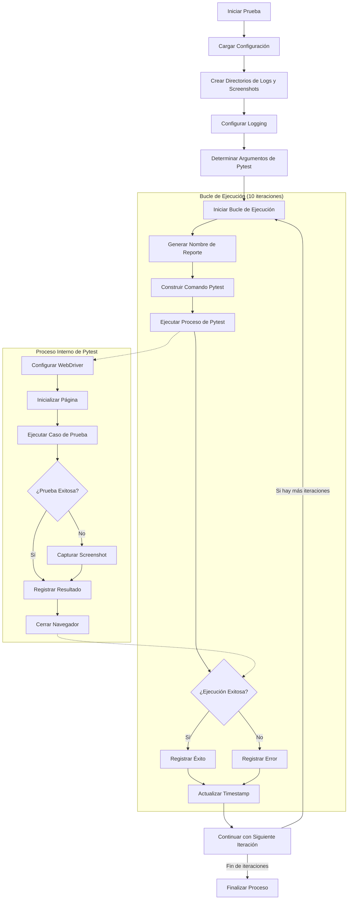

```mermaid
flowchart TD
    A[Iniciar Prueba] --> B[Cargar Configuración]
    B --> C[Crear Directorios de Logs y Screenshots]
    C --> D[Configurar Logging]
    D --> E[Determinar Argumentos de Pytest]
    E --> F[Iniciar Bucle de Ejecución]
    
    subgraph Bucle["Bucle de Ejecución (10 iteraciones)"]
        F --> G[Generar Nombre de Reporte]
        G --> H[Construir Comando Pytest]
        H --> I[Ejecutar Proceso de Pytest]
        I --> J{¿Ejecución Exitosa?}
        J -->|Sí| K[Registrar Éxito]
        J -->|No| L[Registrar Error]
        K --> M[Actualizar Timestamp]
        L --> M
    end
    
    M --> N[Continuar con Siguiente Iteración]
    N -->|Si hay más iteraciones| F
    N -->|Fin de iteraciones| O[Finalizar Proceso]

    subgraph Pytest["Proceso Interno de Pytest"]
        P[Configurar WebDriver] --> Q[Inicializar Página]
        Q --> R[Ejecutar Caso de Prueba]
        R --> S{¿Prueba Exitosa?}
        S -->|Sí| T[Registrar Resultado]
        S -->|No| U[Capturar Screenshot]
        U --> T
        T --> V[Cerrar Navegador]
    end
    
    I -.-> P
    V -.-> J
```